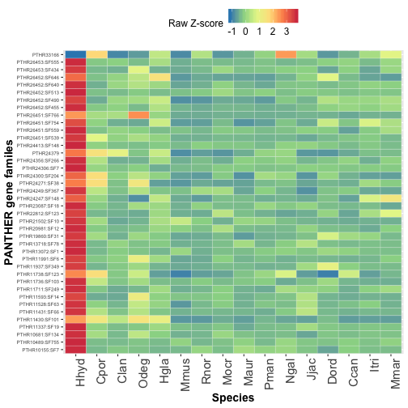
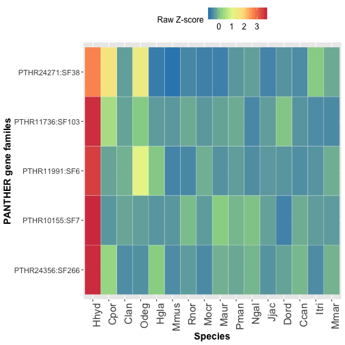

#NOTE:
The input data for this analysis was generated using the **PCA_analysis** code. Load the workspace `PCA.RData`.

##Trimming gene families present in < 15 species

To ensure that there were expansions or contractions of gene families in the capybara lineage relative to the rest of rodents, we had evaluate if each gene family was present in the MRCA of the rodents sampled. Thus, we trimmed gene families in which more than 1 species was missing ==> We kept gene families present in **at least** 15 spp


```r
library(dplyr)

df_counts <- data.frame(avail_panther_fams,BMRat_panther_count,Capybara_panther_count,Castor_panther_count,Chinchilla_panther_count,DeerMouse_panther_count,Degu_panther_count,GrSquirrel_panther_count,GuineaPig_panther_count,Hamster_panther_count,Jerboa_panther_count,KangRat_panther_count,Marmota_panther_count,Mouse_panther_count,NMRat_panther_count,Rat_panther_count,Vole_panther_count)

df_counts_norm <- data.frame(BMRat_panther_count_norm,Capybara_panther_count_norm,Castor_panther_count_norm,Chinchilla_panther_count_norm,DeerMouse_panther_count_norm,Degu_panther_count_norm,GrSquirrel_panther_count_norm,GuineaPig_panther_count_norm,Hamster_panther_count_norm,Jerboa_panther_count_norm,KangRat_panther_count_norm,Marmota_panther_count_norm,Mouse_panther_count_norm,NMRat_panther_count_norm,Rat_panther_count_norm,Vole_panther_count_norm)

df_counts_all <- data.frame(df_counts,df_counts_norm)

df_counts_trim <- NULL
for (i in 1:length(avail_panther_fams)){
	temp_c <- df_counts[i,]
	temp_nc <- df_counts_norm[i,]
	if(sum(temp_c==0) <= 1) #count the number of 'zeros' (species missing for that particular gene family (i)), and extract the information only if 0 or 1 spp are missing
	{
	  d <- inner_join(temp_c,temp_nc)
		df_counts_trim <- rbind(df_counts_trim,d)
	}
}
```

The trimmed data set contains 14,825 gene families present in at least 15 of 16 genomes.

*Z score* computation = iterate by each gene family subset, and normalize the count WITHIN each family per species. NOTE: the normalization was done on the previously standarized values (count/total number of gene families). **The results are in the file  `Zscores.csv`**


```r
spp <- c(rep("Blind Mole Rat",14825),rep("Capybara",14825),rep("Castor",14825),rep("Chinchilla",14825),rep("Deer Mouse",14825),rep("Degu",14825),rep("Ground Squirrel",14825),rep("Guinea Pig",14825),rep("Hamster",14825),rep("Jerboa",14825),rep("Kangaroo Rat",14825),rep("Marmota",14825),rep("Mouse",14825),rep("Naked Mole Rat",14825),rep("Rat",14825),rep("Vole",14825))

count <- c(df_counts_trim$BMRat_panther_count,df_counts_trim$Capybara_panther_count,df_counts_trim$Castor_panther_count,df_counts_trim$Chinchilla_panther_count,df_counts_trim$DeerMouse_panther_count,df_counts_trim$Degu_panther_count,df_counts_trim$GrSquirrel_panther_count,df_counts_trim$GuineaPig_panther_count,df_counts_trim$Hamster_panther_count,df_counts_trim$Jerboa_panther_count,df_counts_trim$KangRat_panther_count,df_counts_trim$Marmota_panther_count,df_counts_trim$Mouse_panther_count,df_counts_trim$NMRat_panther_count,df_counts_trim$Rat_panther_count,df_counts_trim$Vole_panther_count)

count_norm <- c(df_counts_trim$BMRat_panther_count_norm,df_counts_trim$Capybara_panther_count_norm,df_counts_trim$Castor_panther_count_norm,df_counts_trim$Chinchilla_panther_count_norm,df_counts_trim$DeerMouse_panther_count_norm,df_counts_trim$Degu_panther_count_norm,df_counts_trim$GrSquirrel_panther_count_norm,df_counts_trim$GuineaPig_panther_count_norm,df_counts_trim$Hamster_panther_count_norm,df_counts_trim$Jerboa_panther_count_norm,df_counts_trim$KangRat_panther_count_norm,df_counts_trim$Marmota_panther_count_norm,df_counts_trim$Mouse_panther_count_norm,df_counts_trim$NMRat_panther_count_norm,df_counts_trim$Rat_panther_count_norm,df_counts_trim$Vole_panther_count_norm)

panther_fam <- rep(df_counts_trim2$avail_panther_fams,16)

df <- data.frame(spp,panther_fam,count,count_norm)

#Z score computation
IDs<-unique(df$panther_fam)
df_Z <- df[df$panther_fam==IDs[1],]
df_Z$z_score <- scale(df_Z$count_norm)

for (i in 2:length(IDs)){ 
  temp <- df[df$panther_fam==IDs[i],]
  temp$z_score <- scale(temp$count_norm)
  df_Z <- rbind(df_Z,temp)
}
```


##ENRICHMENT TEST
Below is the code to perform the Fisher's exact test on each gene family focusing on capybara. **The results are in the file `Capybara_fisherResults_count.csv`** (NOTE: This file contains a Fisher's extact test for all 23,110 gene families).


```r
fisherPvalues_Capybara <- c()
gene_fam <- c()
IDs<-unique(df$panther_fam)

for (i in 1:length(IDs)){ 
  temp <- df[df$panther_fam==IDs[i],]
  a <- temp$count[2]
  b <- sum(temp$count)-a
  c <- sum(Capybara_panther_count)-a
  d <- sum(BMRat_panther_count,Castor_panther_count,Chinchilla_panther_count,DeerMouse_panther_count,Degu_panther_count,GrSquirrel_panther_count,GuineaPig_panther_count,Hamster_panther_count,Jerboa_panther_count,KangRat_panther_count,Marmota_panther_count,Mouse_panther_count,NMRat_panther_count,Rat_panther_count,Vole_panther_count)-b
  f <- fisher.test(matrix(c(a,b,c,d),nrow=2,ncol=2,byrow=TRUE),alternative="two.sided")
  gene_fam <- c(gene_fam,as.character(IDs[i]))
  fisherPvalues_Capybara <- c(fisherPvalues_Capybara,f$p.value)
}
fisherPvalues_Capybara_Bonferroni <- p.adjust(fisherPvalues_Capybara,method="bonferroni",n=length(fisherPvalues_Capybara))
Capybara_fisherResults <- data.frame(gene_fam,fisherPvalues_Capybara,fisherPvalues_Capybara_Bonferroni)
significativas <- Capybara_fisherResults[Capybara_fisherResults$fisherPvalues_Capybara_Bonferroni<0.05,]
```

##HEATMAP
Use the files `Zscores.csv`and `Capybara_expanded_contracted_gene_families.csv`to plot the heatmap


```r
df_Z <- read.csv("../Zscores.csv",h=TRUE)
famExpCont <- as.character(read.csv2("../Capybara_expanded_contracted_gene_families.csv",h=TRUE)$gene_fam)

#Heatmao of all 40 gene families significantly expanded/contracted in capybara
df_Z <- subset(df_Z,panther_fam %in% famExpCont)
df_Z$spp <- factor(df_Z$spp, levels=c("Capybara","Guinea Pig","Chinchilla","Degu","Naked Mole Rat","Mouse","Rat","Vole","Hamster","Deer Mouse","Blind Mole Rat","Jerboa","Kangaroo Rat","Castor","Ground Squirrel","Marmota")) #Sort spp

name <- c("Ngal","Hhyd","Ccan","Clan","Pman","Odeg","Itri","Cpor","Maur","Jjac","Dord","Mmar","Mmus","Hgla","Rnor","Mocr")
names <- rep(name,5)
df_Z$names <- names
df_Z$names <- factor(df_Z$names, levels=c("Hhyd","Cpor","Clan","Odeg","Hgla","Mmus","Rnor","Mocr","Maur","Pman","Ngal","Jjac","Dord","Ccan","Itri","Mmar")) #Sort spp

library(ggplot2)

ggplot(df_Z, aes(names, panther_fam )) +
  geom_tile(aes(fill = z_score), color = "white") +
  scale_fill_distiller(palette="Spectral") +
  ylab("PANTHER gene familes") +
  xlab("Species") +
  theme(legend.title = element_text(size = 12),
        legend.text = element_text(size = 12),
        legend.position="top",
        plot.title = element_text(size=16),
        axis.title=element_text(size=14,face="bold"),
        axis.text.x = element_text(angle = 90, hjust = 1,size=15),
        axis.text.y = element_text(size=6)) +
  labs(fill = "Raw Z-score") 
```




```r
#Heatmap of gene families expanded related to growth and cancer suppression:
tumor_suppression_Enriched_fam <- c("PTHR11991:SF6","PTHR11736:SF103","PTHR24271:SF38")
growth_Enriched_fam <- c("PTHR24356:SF266","PTHR10155:SF7")
enriched_fams <- c(growth_Enriched_fam,tumor_suppression_Enriched_fam)

df_Zfilt <- subset(df_Z,panther_fam %in% enriched_fams)
df_Zfilt$spp <- factor(df_Zfilt$spp, levels=c("Capybara","Guinea Pig","Chinchilla","Degu","Naked Mole Rat","Mouse","Rat","Vole","Hamster","Deer Mouse","Blind Mole Rat","Jerboa","Kangaroo Rat","Castor","Ground Squirrel","Marmota")) #Sort spp

name <- c("Ngal","Hhyd","Ccan","Clan","Pman","Odeg","Itri","Cpor","Maur","Jjac","Dord","Mmar","Mmus","Hgla","Rnor","Mocr")
names <- rep(name,5)
df_Zfilt$names <- names
df_Zfilt$names <- factor(df_Zfilt$names, levels=c("Hhyd","Cpor","Clan","Odeg","Hgla","Mmus","Rnor","Mocr","Maur","Pman","Ngal","Jjac","Dord","Ccan","Itri","Mmar")) #Sort spp
df_Zfilt$panther_fam <- factor(df_Zfilt$panther_fam,levels=c("PTHR24356:SF266","PTHR10155:SF7","PTHR11991:SF6","PTHR11736:SF103","PTHR24271:SF38")) #Sort gene families

ggplot(df_Zfilt, aes(names, panther_fam )) +
  geom_tile(aes(fill = z_score), color = "white") +
  scale_fill_distiller(palette="Spectral") +
  ylab("PANTHER gene familes") +
  xlab("Species") +
  theme(legend.title = element_text(size = 12),
        legend.text = element_text(size = 12),
        legend.position="top",
        plot.title = element_text(size=16),
        axis.title=element_text(size=14,face="bold"),
        axis.text.x = element_text(angle = 90, hjust = 1,size=15),
        axis.text.y = element_text(size=11)) +
  labs(fill = "Raw Z-score") 
```



